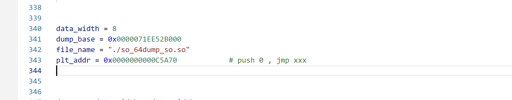
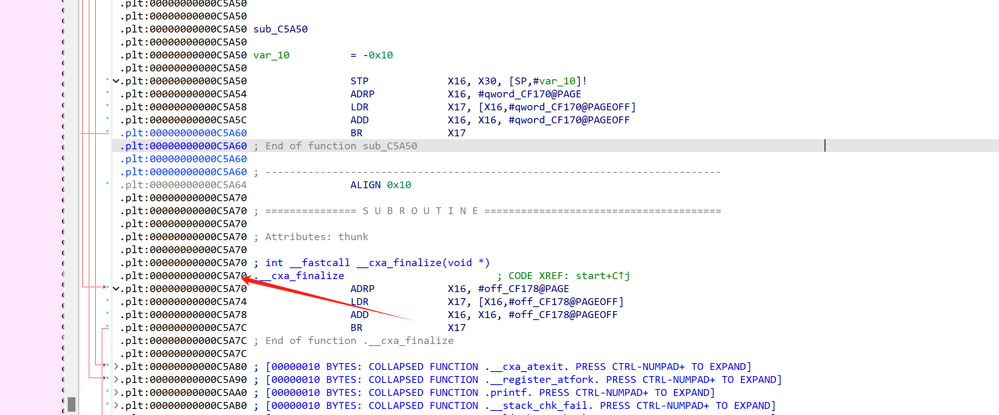

## ElfFixer

用于修复从内存中 dump 下来的ELF文件。

### 使用方法

* data_width 设置8或者4，32位elf文件填4，64位elf文件填8。

* dump_base，dump内存时的地址。

* plt_addr，填第一个plt项的地址：

  

### 原理

* 内存段存盘。
* 修复 JMPREL Relocation Table。
* 修复32位的R_386_32、R_ARM_RELATIVE。
* 修复init_array、fini_array。

### 效果

* 可以修复x86_64、aarch64架构下的64位elf文件。(只测试了这两个架构，可能不止这两个架构)。
* 可以修复x86、arm架构下的部分32位elf文件(如果不使用导入符号的话就可以修复)。
* 修复之后可以正常运行。

### 下一步计划

* 自动化获取 .plt地址。
* 修复安卓 .so文件。

